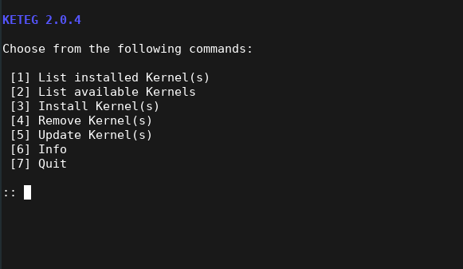

# KETEG
## KErnel TErminal Gui for the Manjaro HardWare Detection Tool
  

Simple and lightweight terminal GUI to manage kernels with the help of the Manjaro Hardware Detection Tool MHWD.

This projects is perfect for people who don't like to work with terminal commands so much and/or are setting up a headless system.

---

Usage: You can execute this script like any other shell script:

```
$ sh keteg.sh
```
or 
```
$ chmod +x keteg.sh
$ ./keteg.sh
```

---


